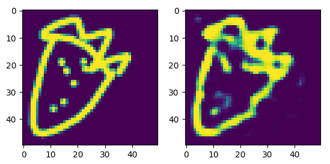

# SketchCNN AutoEncoder #
Train an autoencoder to encode partially drawn images from Google's [Quickdraw Dataset](https://quickdraw.withgoogle.com/data). This autoencoder can then be used to bootstrap downstream tasks such as image classification or stroke generation.


<p align="center">

</p>


## Usage ##
```bash
python3 download_bitmaps.py drawings
python3 train.py
```


## TODO ##
Implement data augmentations for strokes
